---
## Front matter
lang: ru-RU
title: Отчёт по лабораторной работе №2
author: |
   Арсоева Залина НБИбд-01-21\inst{1}

institute: |
 \inst{1}Российский Университет Дружбы Народов

date: 11 декабря, 2022, Москва, Россия

## Formatting
mainfont: PT Serif
romanfont: PT Serif
sansfont: PT Sans
monofont: PT Mono
toc: false
slide_level: 2
theme: metropolis
header-includes: 
 - \metroset{progressbar=frametitle,sectionpage=progressbar,numbering=fraction}
 - '\makeatletter'
 - '\beamer@ignorenonframefalse'
 - '\makeatother'
aspectratio: 43
section-titles: true

---
##  Цель работы

– Изучить идеологию и применение средств контроля версий.
– Освоить умения по работе с git.

##  Выполнение лабораторной работы

Зададим имя и email владельца репозитория, кодировку и прочие параметры.

Создаю аккаунт на github.

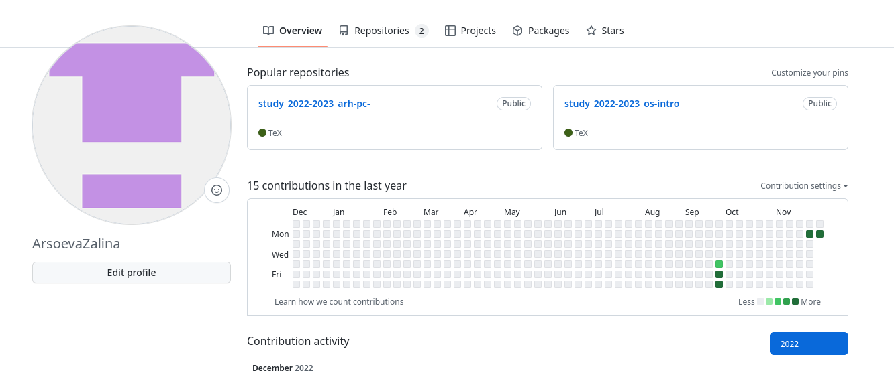

## 

Устанавливаем git-glow и gh

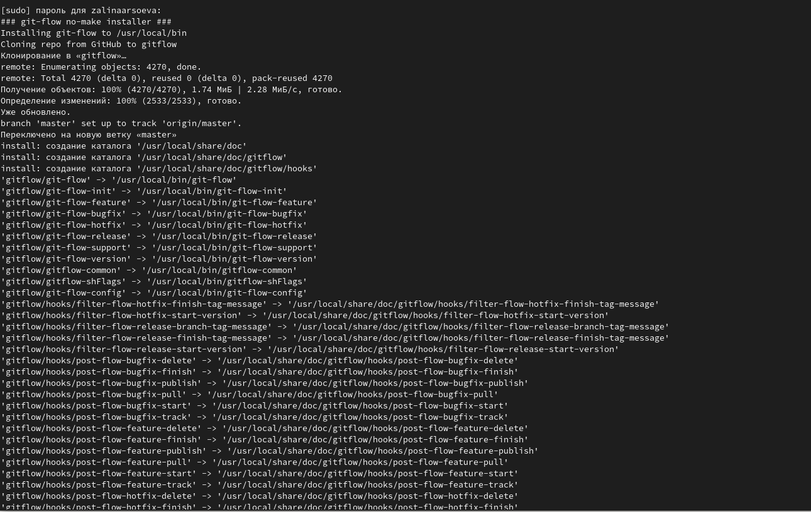

## 

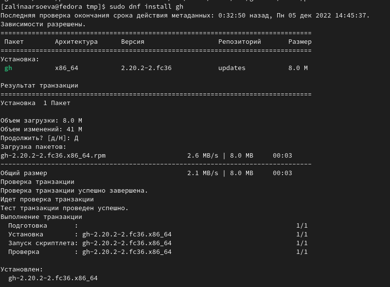

## 

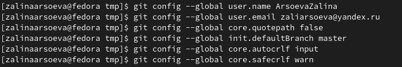

## 

Создаем ключи

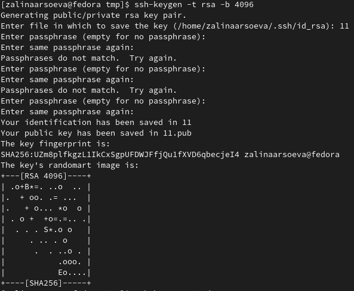

## 

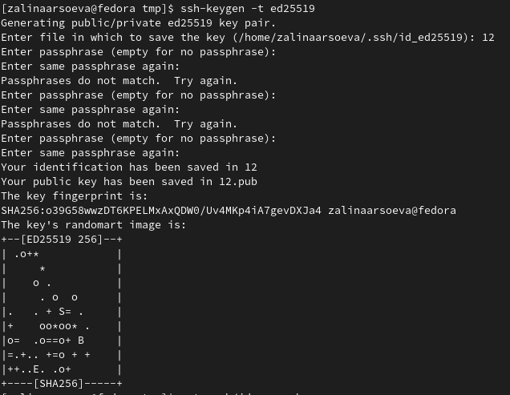

## 

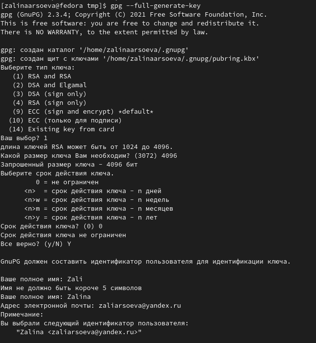

## 

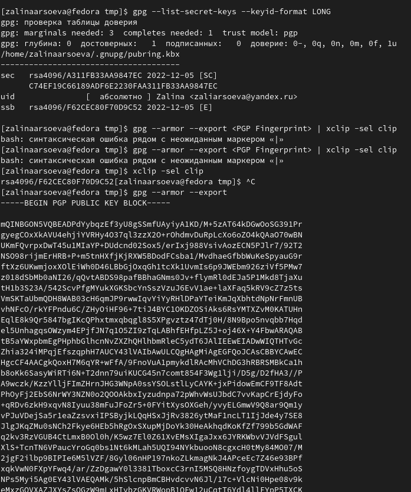

## 

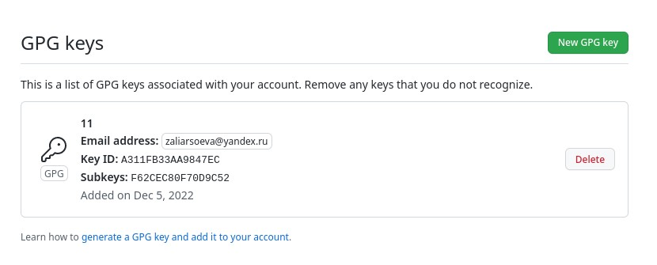

## 

Настройка автоматических подписей коммитов git

## 

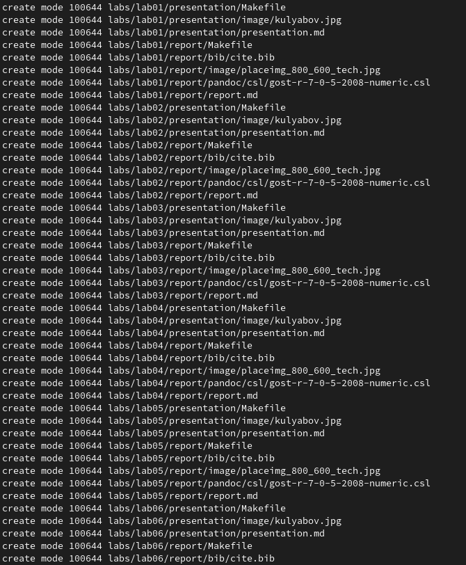

## 

Загрузка шаблона репозитория и синхронизация

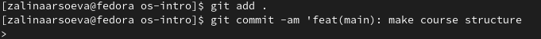

## 

Подготовка репозитория и коммит изменений

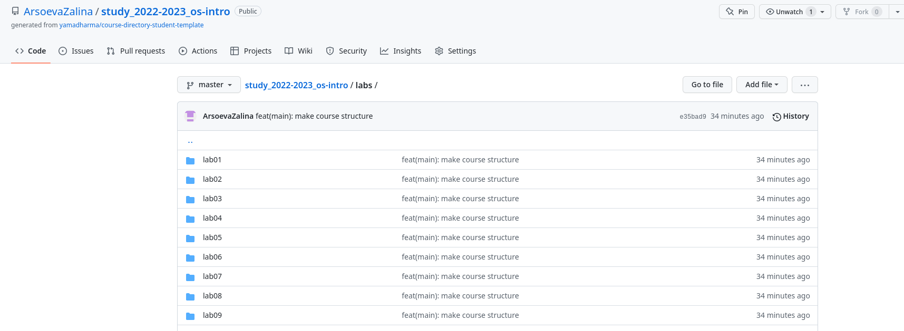

##  Вывод

Мы приобрели практические навыки работы с сервисом github.