## Front matter

title: "Отчёт по лабораторной работе №2"

author: "Арсоева Залина"

## Generic otions

lang: ru-RU

toc-title: "Содержание"

## Bibliography

bibliography: bib/cite.bib

csl: pandoc/csl/gost-r-7-0-5-2008-numeric.csl

## Pdf output format

toc: true # Table of contents

toc-depth: 2

lof: true # List of figures

lot: true # List of tables

fontsize: 12pt

linestretch: 1.5

papersize: a4

documentclass: article

## I18n polyglossia

polyglossia-lang:

name: russian

options:

- spelling=modern

- babelshorthands=true

polyglossia-otherlangs:

name: english

## I18n babel

babel-lang: russian

babel-otherlangs: english

## Fonts

mainfont: PT Serif

romanfont: PT Serif

sansfont: PT Sans

monofont: PT Mono

mainfontoptions: Ligatures=TeX

romanfontoptions: Ligatures=TeX

sansfontoptions: Ligatures=TeX,Scale=MatchLowercase

monofontoptions: Scale=MatchLowercase,Scale=0.9

## Biblatex

biblatex: true

biblio-style: "gost-numeric"

biblatexoptions:

- parentracker=true

- backend=biber

- hyperref=auto

- language=auto

- autolang=other*

- citestyle=gost-numeric

## Pandoc-crossref LaTeX customization

figureTitle: "Рис."

tableTitle: "Таблица"

listingTitle: "Листинг"

lofTitle: "Список иллюстраций"

lotTitle: "Список таблиц"

lolTitle: "Листинги"

## Misc options

indent: true

header-includes:

- \usepackage{indentfirst}

- \usepackage{float} # keep figures where there are in the text

- \floatplacement{figure}{H} # keep figures where there are in the text

---

#  Цель работы

– Изучить идеологию и применение средств контроля версий.
– Освоить умения по работе с git.

#  Задание
Создать базовую конфигурацию для работы с git.  
–  Создать ключ  SSH.  
–  Создать ключ  PGP.  
–  Настроить подписи git.  
–  Зарегистрироваться на  Github.  
–  Создать локальный каталог для выполнения заданий по предмету

#  Выполнение лабораторной работы

Зададим имя и email владельца репозитория, кодировку и прочие параметры.

Создаю аккаунт на github.

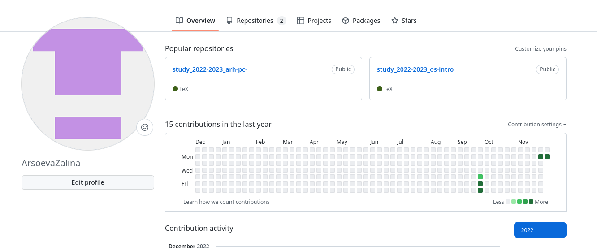

Устанавливаем git-glow и gh

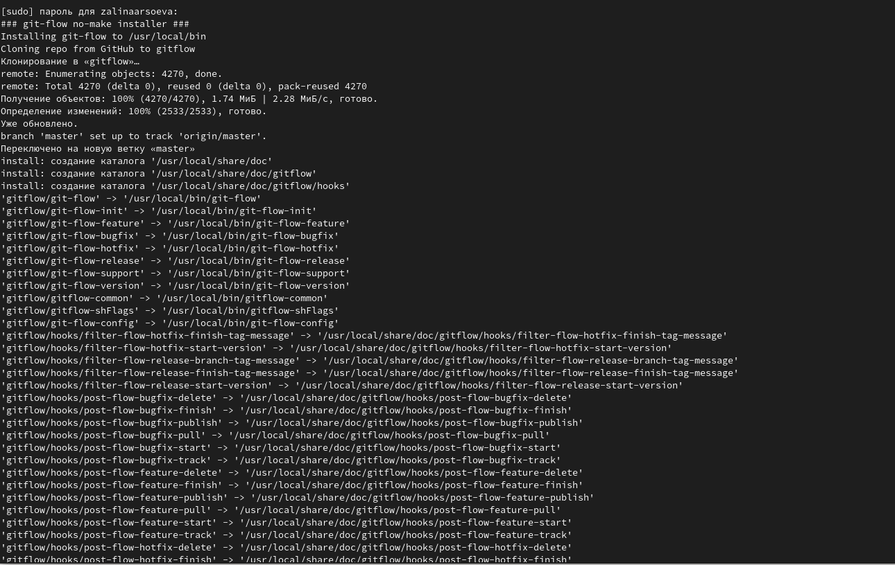

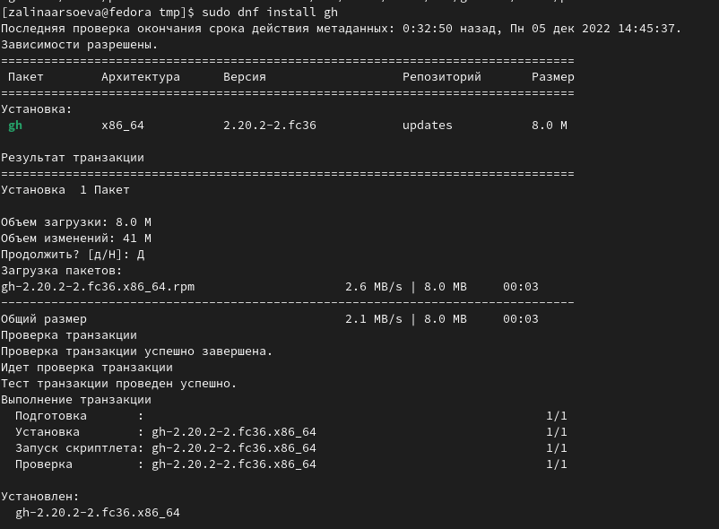

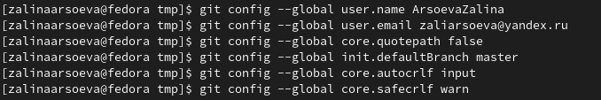

Создаем ключи

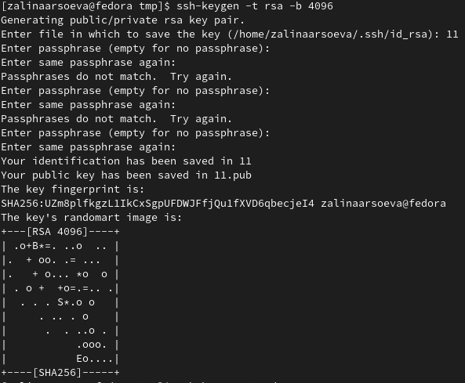

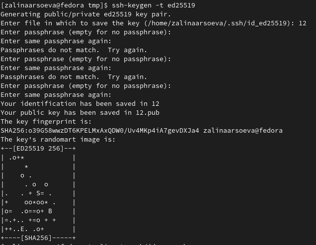

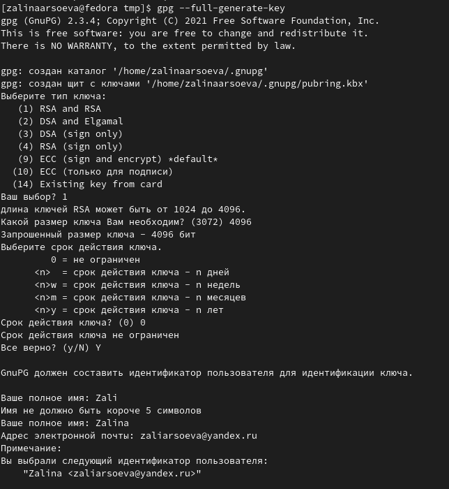

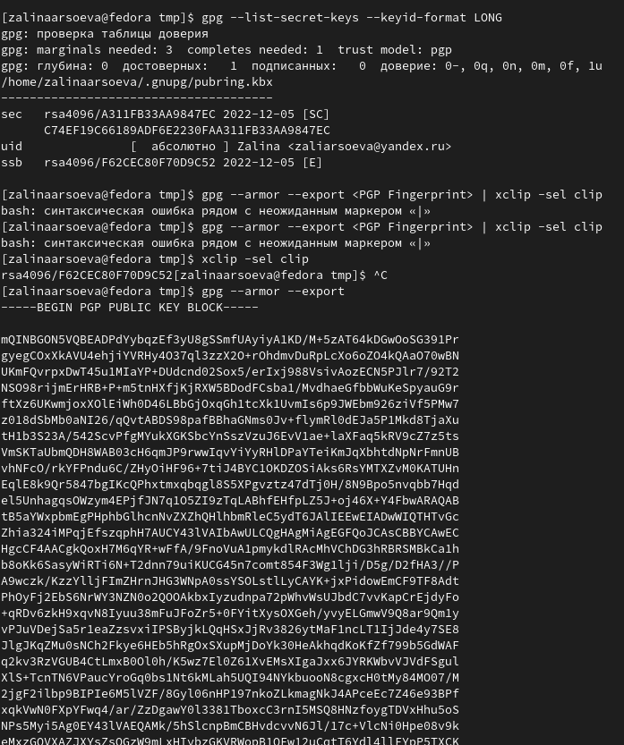

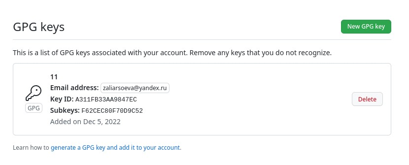

Настройка автоматических подписей коммитов git

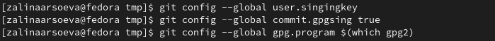

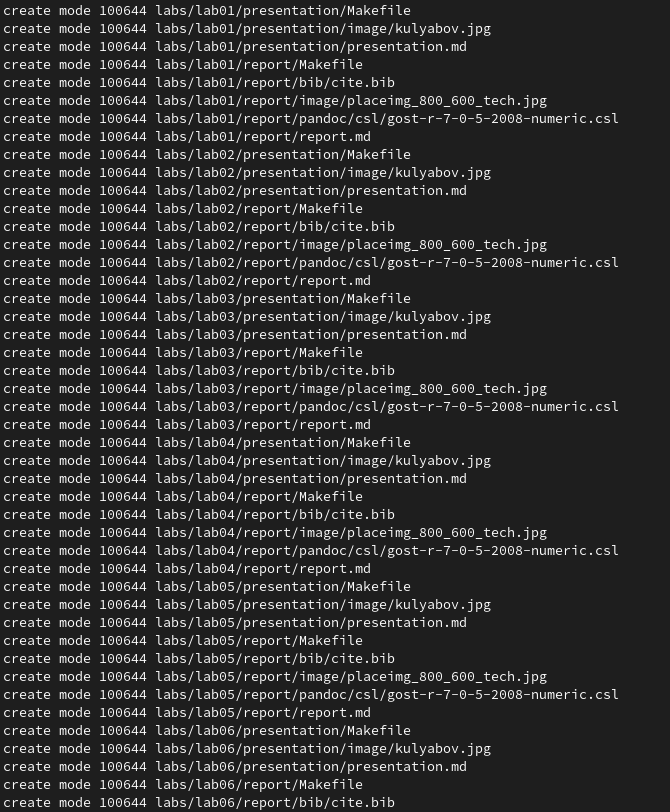

Загрузка шаблона репозитория и синхронизация

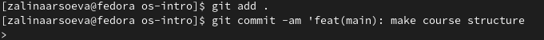

Подготовка репозитория и коммит изменений

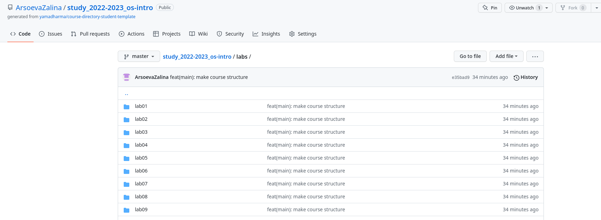

#  Вывод

Мы приобрели практические навыки работы с сервисом github.

#  Контрольные вопросы

1. Что такое системы контроля версий (VCS) и для решения каких задач они предназначаются?

Системы контроля версий (Version Control System, VCS) применяются при работе нескольких человек над одним проектом. Обычно основное дерево проекта хранится в локальном

или удалённом репозитории, к которому настроен доступ для участников проекта. При

внесении изменений в содержание проекта система контроля версий позволяет их

фиксировать, совмещать изменения, произведённые разными участниками проекта,

производить откат к любой более ранней версии проекта, если это требуется

2. Объясните следующие понятия VCS и их отношения: хранилище, commit, история, рабочая копия.

* хранилище - пространство на накопителе где расположен репозиторий

* commit - сохранение состояния хранилища

* история - список изменений хранилища (коммитов)

* рабочая копия - локальная копия сетевого репозитория, в которой работает программист. Текущее состояние файлов проекта, основанное на версии, загруженной из хранилища (обычно на последней)

3. Что представляют собой и чем отличаются централизованные и децентрализованные VCS? Приведите примеры VCS каждого вида.

Централизованные системы контроля версий представляют собой приложения типа клиент-сервер, когда репозиторий проекта существует в единственном экземпляре и хранится на сервере. Доступ к нему осуществлялся через специальное клиентское приложение. В качестве примеров таких программных продуктов можно привести CVS, Subversion.

Распределенные системы контроля версий (Distributed Version Control System, DVCS) позволяют хранить репозиторий (его копию) у каждого разработчика, работающего с данной системой. При этом можно выделить центральный репозиторий (условно), в который будут отправляться изменения из локальных и, с ним же эти локальные репозитории будут синхронизироваться. При работе с такой системой, пользователи периодически синхронизируют свои локальные репозитории с центральным и работают непосредственно со своей локальной копией. После внесения достаточного количества изменений в локальную копию они (изменения) отправляются на сервер. При этом сервер, чаще всего, выбирается условно, т.к. в большинстве DVCS нет такого понятия как “выделенный сервер с центральным репозиторием”.

4. Опишите действия с VCS при единоличной работе с хранилищем.

Один пользователь работает над проектом и по мере необходимости делает коммиты, сохраняя определенные этапы.

5. Опишите порядок работы с общим хранилищем VCS.

Несколько пользователей работают каждый над своей частью проекта. При этом каждый должен работать в своей ветки. При завершении работы ветка пользователя сливается с основной веткой проекта.

6. Каковы основные задачи, решаемые инструментальным средством git?

* Ведение истории версий проекта: журнал (log), метки (tags), ветвления (branches).

* Работа с изменениями: выявление (diff), слияние (patch, merge).

* Обеспечение совместной работы: получение версии с сервера, загрузка обновлений на сервер.

7. Назовите и дайте краткую характеристику командам git.

* git config - установка параметров

* git status - полный список изменений файлов, ожидающих коммита

* git add . - сделать все измененные файлы готовыми для коммита.

* git commit -m "[descriptive message]" - записать изменения с заданным сообщением.

* git branch - список всех локальных веток в текущей директории.

* git checkout [branch-name] - переключиться на указанную ветку и обновить рабочую директорию.

* git merge [branch] — соединить изменения в текущей ветке с изменениями из заданной.

* git push - запушить текущую ветку в удаленную ветку.

* git pull - загрузить историю и изменения удаленной ветки и произвести слияние с текущей веткой.

8. Приведите примеры использования при работе с локальным и удалённым репозиториями.

* git remote add [имя] [url] — добавляет удалённый репозиторий с заданным именем;

* git remote remove [имя] — удаляет удалённый репозиторий с заданным именем;

* git remote rename [старое имя] [новое имя] — переименовывает удалённый репозиторий;

* git remote set-url [имя] [url] — присваивает репозиторию с именем новый адрес;

* git remote show [имя] — показывает информацию о репозитории.

9. Что такое и зачем могут быть нужны ветви (branches)?

Ветвление — это возможность работать над разными версиями проекта: вместо одного списка с упорядоченными коммитами история будет расходиться в определённых точках. Каждая ветвь содержит легковесный указатель HEAD на последний коммит, что позволяет без лишних затрат создать много веток. Ветка по умолчанию называется master, но лучше назвать её в соответствии с разрабатываемой в ней функциональностью.

10. Как и зачем можно игнорировать некоторые файлы при commit?

Нет проблем если шаблон для игнорирования подходит для файла под контролем версий, или вы добавили файл, который игнорируется. Шаблоны не имеют никакого эффекта на файлы под контролем версий, они только определяют показываются неизвестные файлы, или просто игнорируются. Файл git.rignore обычно должен быть под контролем версий, что бы новые копии ветки видели такие же шаблоны: git add . gitignore git commit -m "Добавлены шаблоны для игнорирования". Многие деревья с исходным кодом содержат файлы, которые не нужно хранить под контролем версий, например, резервные файлы текстового редактора, объектные файлы и собранные программы. Вы можете просто не добавлять их, но они всегда будут обнаруживаться как неизвестные. Вы также можете сказать bzr игнорировать их добавив их в файл в корне рабочего дерева. Этот файл содержит список шаблонов файлов, по одному в каждой строчке. Обычное содержимое может быть таким: *.o *~ *.tmp *.py [ co ] Если шаблон содержит слеш, то он будет сопоставлен с полным путем начиная от корня рабочего дерева; иначе он сопоставляется только с именем файла. Таким образом пример выше игнорирует файлы с расширением .o во всех подкаталогах, но пример ниже игнорирует только config.h в корне рабочего дерева и HTML файлы в каталоге doc/: ./config.h doc/*.html Для получения списка файлов которые игнорируются и соответствующих им шаблонов используйте команду git ignored : $ git ignored config.h ./config.h configure.in~ *~ $

#  Список литературы

::: {#refs}

