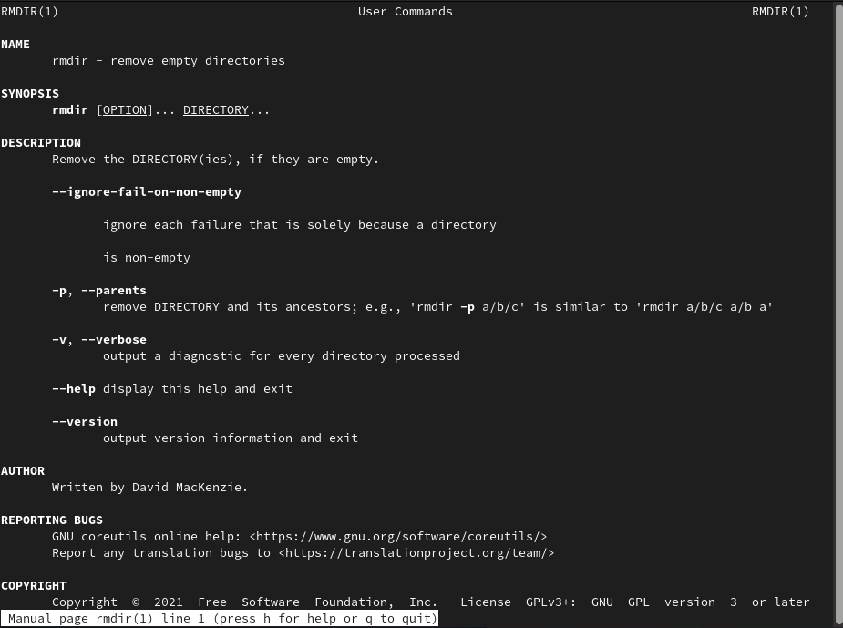

---
## Front matter
lang: ru-RU
title: Основы интерфейса взаимодействия
пользователя с системой Unix на уровне командной строки
author: |
   Арсоева Залина НБИбд-01-21\inst{1}

institute: |
 \inst{1}Российский Университет Дружбы Народов

date: 11 декабря, 2022, Москва, Россия

## Formatting
mainfont: PT Serif
romanfont: PT Serif
sansfont: PT Sans
monofont: PT Mono
toc: false
slide_level: 2
theme: metropolis
header-includes: 
 - \metroset{progressbar=frametitle,sectionpage=progressbar,numbering=fraction}
 - '\makeatletter'
 - '\beamer@ignorenonframefalse'
 - '\makeatother'
aspectratio: 43
section-titles: true

---

## Цель работы

Приобретение практических навыков взаимодействия пользователя с системой по-средством командной строки.

## Выполнение лабораторной работы

##

Определяю, если ли в каталогах подкаталог с именем cron, его нет.
А также создам одной командой три новых каталога, а потом удалю ранее созданый каталог newdir

##

С помощью команды man определяю опции команды ls, cd, pwd, mkdir, rmdir, rm.

Разница в выводимой на экран информации:
Команда ls выводит содержимое каталога.
Команда ls -l выводит подробный список, в котором будет отображаться владелец, группа, дата создания, размер и другие параметры.
Команда ls -F показывает тип объекта.

##

С помощью команды man определила, какую опцию команды ls нужно использовать для просмотра содержимого не только указанного каталога, но и подкаталогов, входящих в него.
А именно: -R, --recursive
list subdirectories recursively

##

С помощью команды man определила набор опций команды ls, позволяющий отсортировать по времени последнего изменения выводимый список содержимого каталога с развёрнутым описанием файлов.
А именно: --time-style=TIME STYLE
-t
-T
-u

##

Использовала команду man для просмотра описания следующих команд: cd, pwd,
mkdir, rmdir, rm. 

##

##

##

##

##

Основные опции этих команд:
cd – команда перемещения по файловой системе.
pwd – команда показывающая директорию, в которой находится пользователь.
mkdir – команда, создающая новую директорию.
rmdir – команда, удаляющая файлы, которые должны быть пустыми.
rm - команда, удаляющая файлы или целые деревья каталогов.

##

Используя информацию, полученную при помощи команды history, выполнила
модификацию и исполнение нескольких команд из буфера команд.
Команда history
q

##

## Вывод

Мы приобрели практические навыки взаимодействия пользователя с системой посредством командной строки.