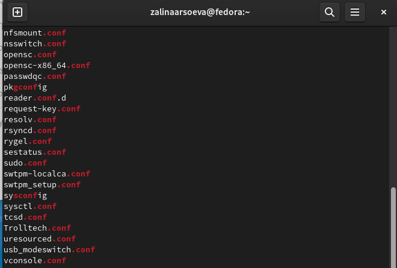

---
## Front matter
lang: ru-RU
title: Инструкция поиска файлов и фильтрация  текстовых данных
author: |
   Арсоева Залина НБИбд-01-21\inst{1}

institute: |
 \inst{1}Российский Университет Дружбы Народов

date: 11 декабря, 2022, Москва, Россия

## Formatting
mainfont: PT Serif
romanfont: PT Serif
sansfont: PT Sans
monofont: PT Mono
toc: false
slide_level: 2
theme: metropolis
header-includes: 
 - \metroset{progressbar=frametitle,sectionpage=progressbar,numbering=fraction}
 - '\makeatletter'
 - '\beamer@ignorenonframefalse'
 - '\makeatother'
aspectratio: 43
section-titles: true

---

## Цель работы

Ознакомление с инструментами поиска файлов и фильтрации текстовых данных.
Приобретение практических навыков: по управлению процессами (и заданиями), по
проверке использования диска и обслуживанию файловых систем.

## Выполнение лабораторной работы

Вошла в систему, используя свой пароль.
Записываю в файл file.txt названия файлов, содержащихся в каталоге /etc. Дописываю в этот же файл названия файлов, содержащихся в домашнем каталоге. 

##

Вывожу имена всех файлов из file.txt, имеющих расширение .conf, после чего записала их в новых текстовый файл conf.txt 

##

Определила, какие файлы в домашнем каталоге имеют имена, которые начинаются с символа с.Привела несколько примеров, как это сделать.

##

Вывел на экран имена файлов из каталога /etc, начинающиеся с символа h.

##

##

Запустила в фоновом режиме процесс, который будет записывать в файл ~/logfile файлы, имена которых начинаются с log.
Удалила файл ~/logfile.

##

Запустила из консоли в фоновом режиме редактор gedit.

##

##

Определила идентификатор процесса gedit
Используя команду ps, конвейер и
фильтр grep. Более простым способом определить этот идентификатор не получилось.

Прочитала справку (man) команды kill, после чего использовала её для завершения процесса gedit.

##

##

Выполнила команды df и du
Предварительно получив более подробную информацию об этих командах, с помощью команды man.

##

##

##

Воспользовавшись справкой команды find, вывела имена всех директорий, имеющихся в домашнем каталоге.

##

## Выводы
Ознакомилась с инструментами поиска файлов и фильтрацией текстовых данных, приобрела практические навыки, как по управлению процессами, так и по проверке использования диска и обслуживанию файловых систем.