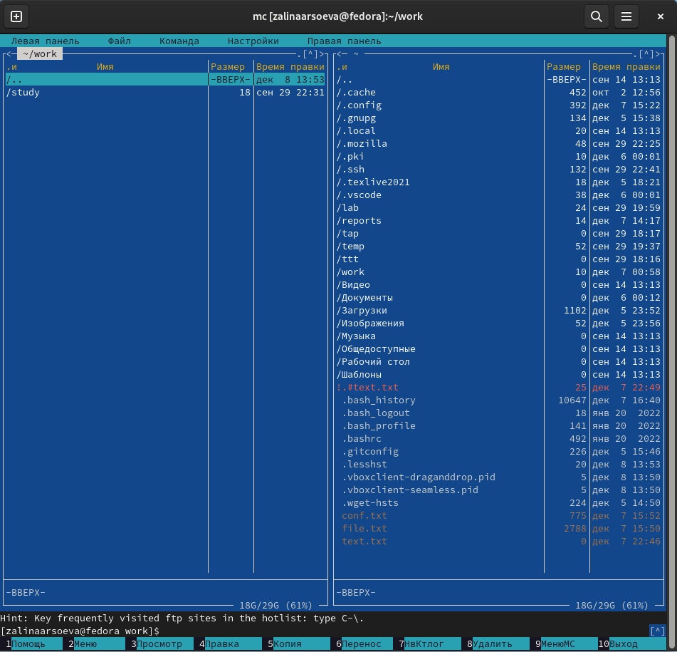
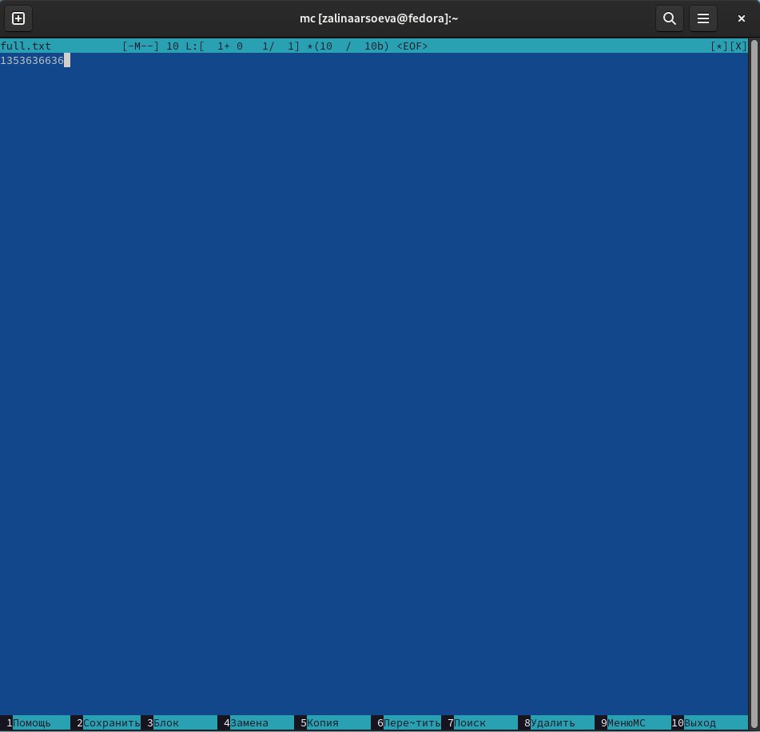
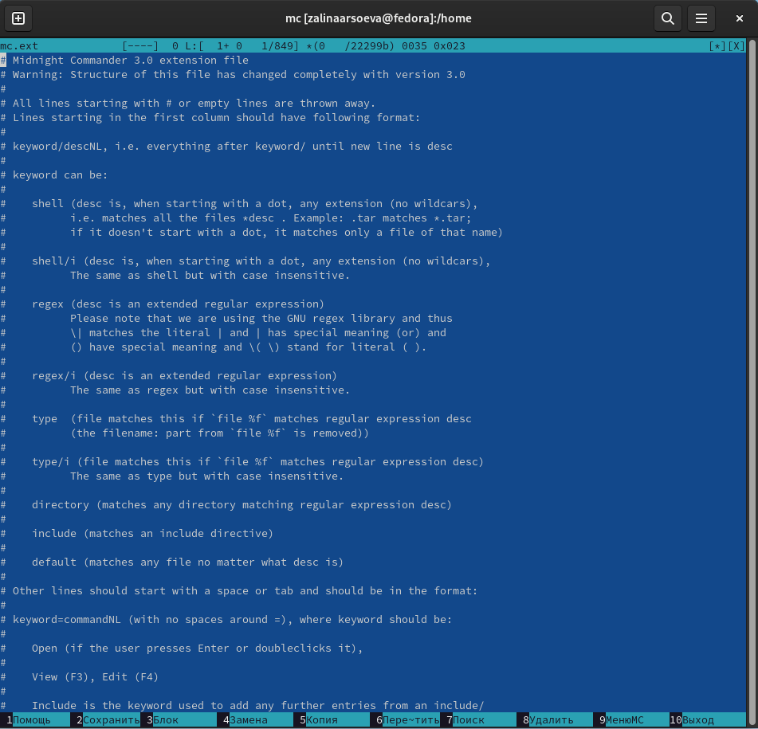
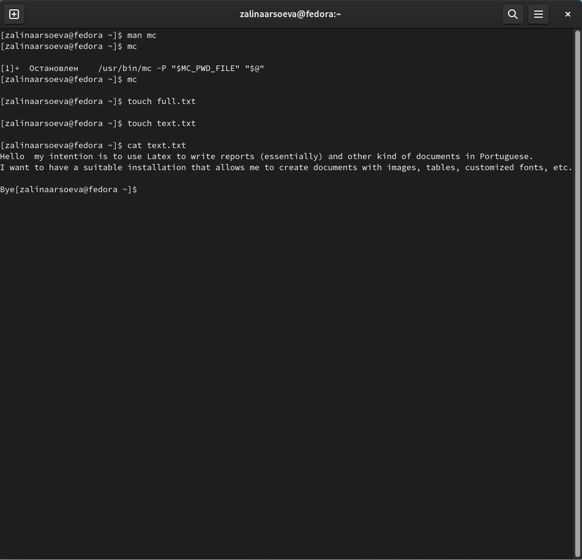

---
## Front matter
lang: ru-RU
title: Командная оболочка Midnight Commander
author: |
   Арсоева Залина НБИбд-01-21\inst{1}

institute: |
 \inst{1}Российский Университет Дружбы Народов

date: 11 декабря, 2022, Москва, Россия

## Formatting
mainfont: PT Serif
romanfont: PT Serif
sansfont: PT Sans
monofont: PT Mono
toc: false
slide_level: 2
theme: metropolis
header-includes: 
 - \metroset{progressbar=frametitle,sectionpage=progressbar,numbering=fraction}
 - '\makeatletter'
 - '\beamer@ignorenonframefalse'
 - '\makeatother'
aspectratio: 43
section-titles: true

---

## Цель работы

Освоение основных возможностей командной оболочки Midnight Commander.Приобретение навыков практической работы по просмотру каталогов и файлов; 
манипуляций с ними.

## Выполнение лабораторной работы

Изучила информацию о mc, вызвав в командной строке man mc. 

##

Запустила из командной строки mc, изучила его структуру и меню.

##

Выполнила несколько операций в mc, используя управляющие клавиши
(операции с панелями; выделение/отмена выделения файлов, копирование/перемещение файлов, получение информации о размере и правах доступа на файлы и/или каталоги и т.п.)

##

##

##

Выполнила основные команды меню левой (или правой) панели. Вывод информации о файлах достаточно подробный.(

##

Используя возможности подменю Файл, выполнила:
– просмотр содержимого текстового файла;

##

– редактирование содержимого текстового файла (без сохранения результатов
редактирования);

– создание каталога;

– копирование файлов в созданный каталог.

##

##

##

С помощью соответствующих средств подменю Команда осуществила:
– поиск в файловой системе файла с заданными условиями;

##

– выбор и повторение одной из предыдущих команд;
- переход в домашний каталог;
– анализ файла меню и файла расширений

##

##

##

Вызвала подменю Настройки. Освоила операции, определяющие структуру
экрана mc (Full screen, Double Width, Show Hidden Files и т.д.)

## Задание по встроенному редактору mc

Создала текстовый файл text.txt

##

 Открыла этот файл с помощью встроенного в mc редактора

##

Вставила в открытый файл небольшой текст, скопированный из Интернета.

##

Проделала с текстом следующие манипуляции, используя горячие клавиши: 
Удалила строку.
Выделила фрагмент текста и скопировала его на новую строку.
Выделил афрагмент текста и перенесла его на новую строку.(

##

##

##

Сохранила файл.
Отменила последнее действие
Перешла в конец файла(нажав комбинацию клавиш) и написала некоторый текст.
Перешла в начало файла(нажав комбинацию клавиш) и написала некоторый текст.
Сохранила и закрыла файл.

##

##

##

##

##

Открыла файл с исходным текстом в терминале.

##

Используя меню редактора, выключила подсветку синтаксиса

## Вывод

Освоила основные возможности командной оболочки Midnight Commander, приобрела навыки практической работы по просмотру каталогов и файлов; манипуляций с ними.
