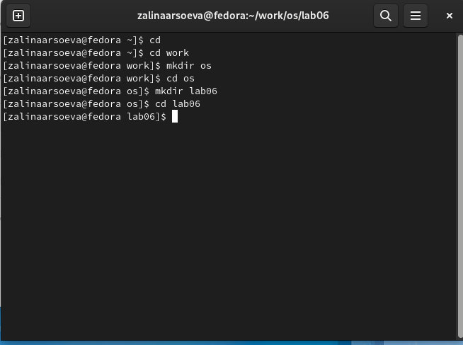
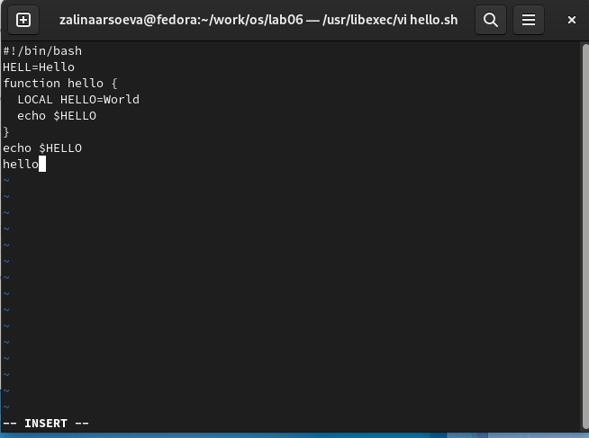
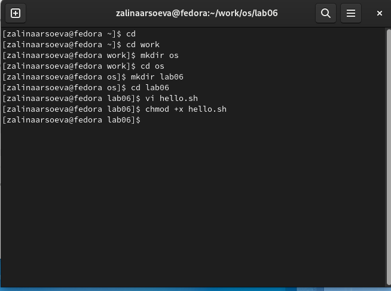
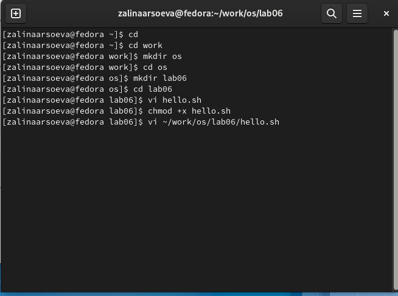
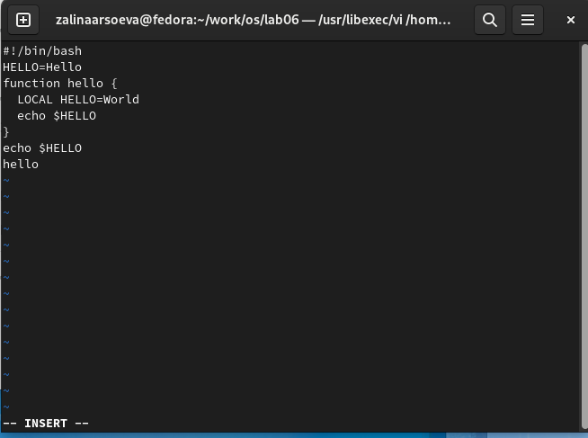
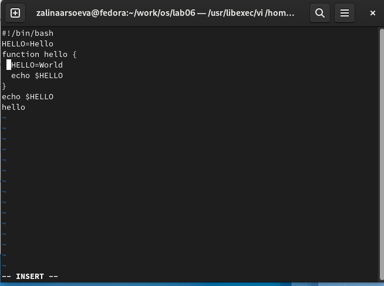
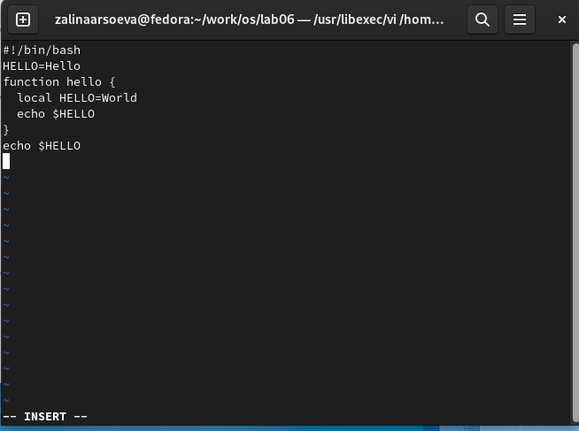
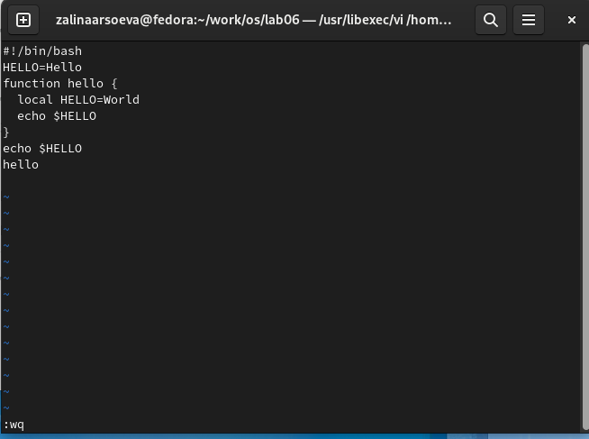

---
## Front matter
lang: ru-RU
title: Текстовой редактор vi
author: |
   Арсоева Залина НБИбд-01-21\inst{1}

institute: |
 \inst{1}Российский Университет Дружбы Народов

date: 11 декабря, 2022, Москва, Россия

## Formatting
mainfont: PT Serif
romanfont: PT Serif
sansfont: PT Sans
monofont: PT Mono
toc: false
slide_level: 2
theme: metropolis
header-includes: 
 - \metroset{progressbar=frametitle,sectionpage=progressbar,numbering=fraction}
 - '\makeatletter'
 - '\beamer@ignorenonframefalse'
 - '\makeatother'
aspectratio: 43
section-titles: true

---

## Цель работы

Познакомиться с операционной системой Linux.Получить практические навыки работы с редактором vi,установленным по умолчанию практически во всех дистрибутивах

## Выполнение лабораторной работы
## Задание 1. Создание нового файла с использованием vi

Создаю каталог с именем ~/work/os/lab06.
Перехожу во вновь созданный каталог.
Вызвала vi и создаю файл hello.sh

##

##

Нажимаю клавишу i и ввожу следующий текст:

1 #!/bin/bash
2 HELL=Hello
3 function hello {
4 LOCAL HELLO=World
5 echo $HELLO
6 }
7 echo $HELLO
8 hello

##

Далее нажимаю клавишу Esc для перехода к командный режим после завершения ввода текста.(
Также нажимаю ":" для перехода в режим последней строки и внизу экрана появилось приглашение в виде двоеточия.
Нажимаю w(записать) и q(выйти), а затем нажала клавишу Enter для сохранения текста и завершения работы.

##

Сделала файл исполняемым.

## Задание 2. Редактирование существующего файла

Вызываю vi на редактирование файла.

##

Установила курсор в конец слова HELL второй строки.
Далее перехожу в режим вставки и заменила его на HELLO,  нажал Esc для возврата в командый режим.(

##

Установлю курсор на четвертую строку и сотру слова LOCAL.

##

Перешла в режим вставки и набрала следующий текст: local, нажала Esc для возврата в командный режим.

 

 ##
 
Установила курсор на последней строке файла. Вставила после неё строку, содержащую следующий текст: echo $HELLO.
Нажала Esc для перехода в командный режим.
Удалила последнюю строку.

##

Ввел символ «:» для перехода в режим последней строки. Записал произведённые изменения и вышел из vi.

## Вывод

Я познакомилась с операционной системой Linux, получила практические навыки работы с редактором vi, установленным по умолчанию практически во всех дистрибутивах.