---
## Front matter
title: "Лабораторная работа-09"
subtitle: "Текстовoй редактор emacs"
author: "Арсоева Залина НБИбд-01-21"

## Generic otions
lang: ru-RU
toc-title: "Содержание"

## Bibliography
bibliography: bib/cite.bib
csl: pandoc/csl/gost-r-7-0-5-2008-numeric.csl

## Pdf output format
toc: true # Table of contents
toc-depth: 2
lof: true # List of figures
lot: true # List of tables
fontsize: 12pt
linestretch: 1.5
papersize: a4
documentclass: scrreprt
## I18n polyglossia
polyglossia-lang:
  name: russian
  options:
	- spelling=modern
	- babelshorthands=true
polyglossia-otherlangs:
  name: english
## I18n babel
babel-lang: russian
babel-otherlangs: english
## Fonts
mainfont: PT Serif
romanfont: PT Serif
sansfont: PT Sans
monofont: PT Mono
mainfontoptions: Ligatures=TeX
romanfontoptions: Ligatures=TeX
sansfontoptions: Ligatures=TeX,Scale=MatchLowercase
monofontoptions: Scale=MatchLowercase,Scale=0.9
## Biblatex
biblatex: true
biblio-style: "gost-numeric"
biblatexoptions:
  - parentracker=true
  - backend=biber
  - hyperref=auto
  - language=auto
  - autolang=other*
  - citestyle=gost-numeric
## Pandoc-crossref LaTeX customization
figureTitle: "Рис."
tableTitle: "Таблица"
listingTitle: "Листинг"
lofTitle: "Список иллюстраций"
lotTitle: "Список таблиц"
lolTitle: "Листинги"
## Misc options
indent: true
header-includes:
  - \usepackage{indentfirst}
  - \usepackage{float} # keep figures where there are in the text
  - \floatplacement{figure}{H} # keep figures where there are in the text
---

# Цель работы

Познакомиться с операционной системой Linux.Получить практические навыки работы с редактором emacs

# Задание 1 Создание нового файла с использованием emacs

1. Открыть emacs.

2. Создать файл lab07.sh с помощью комбинации Ctrl-x Ctrl-f (C-x C-f).

3. Наберите текст:

1 #!/bin/bash

2 HELL=Hello

3 function hello {

4 LOCAL HELLO=World

5 echo $HELLO

6 }

7 echo $HELLO

8 hello

4. Сохранить файл с помощью комбинации Ctrl-x Ctrl-s (C-x C-s).

5. Проделать с текстом стандартные процедуры редактирования,каждое действие долж-
но осуществляться комбинацией клавиш.

5.1. Вырезать одной командой целую строку (С-k).

5.2. Вставить эту строку в конец файла (C-y).

5.3. Выделить областьтекста (C-space).

5.4. Скопировать область в буфер обмена (M-w).

5.5. Вставить область в конец файла.

5.6. Вновь выделить эту область и на этотраз вырезать её (C-w).

5.7. Отмените последнее действие (C-/).

6. Научитесь использовать команды по перемещению курсора.

6.1. Переместите курсор в начало строки (C-a).

6.2. Переместите курсор в конец строки (C-e).

6.3. Переместите курсор в начало буфера (M-<).

6.4. Переместите курсор в конец буфера (M->).

7. Управление буферами.

7.1. Вывести список активных буферов на экран (C-x C-b)

7.2. Переместитесь во вновь открытое окно (C-x) o со списком открытых буферов
и переключитесь на другой буфер.

7.3. Закройте это окно (C-x 0).

7.4. Теперь вновь переключайтесь между буферами,но уже без вывода их списка на
экран (C-x b).

8. Управление окнами.

8.1. Поделите фрейм на 4 части: разделите фрейм на два окна по вертикали (C-x 3),
а затем каждое из этих окон на две части по горизонтали (C-x 2) 

8.2. В каждом из четырёх созданных окон откройте новый буфер (файл) и введите
несколько строктекста.

9. Режим поиска

9.1. Переключитесьв режим поиска (C-s) и найдите несколько слов,присутствующих
втексте.

9.2. Переключайтесь между результатами поиска,нажимая C-s.

9.3. Выйдите из режима поиска,нажав C-g.

9.4. Перейдите в режим поиска и замены (M-%),введитетекст,который следует найти
и заменить,нажмите Enter ,затем введитетекстдля замены.Послетого как будут
подсвечены результаты поиска,нажмите ! для подтверждения замены.

9.5. Испробуйте другой режим поиска,нажав M-s o.Объясните,чем он отличается от
обычного режима?

# Выполнение лабораторной работы

# Создание нового файла с использованием vi

1.Открыла emacs.(рис. [-@fig:001])

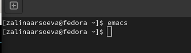{ #fig:001 width=70% }

2.Создала файл lab07.sh с помощью комбинации Ctrl-x Ctrl-f (C-x C-f).(рис. [-@fig:002])

{ #fig:002 width=70% }

3.Набрала текст:(рис. [-@fig:003])

1 #!/bin/bash

2 HELL=Hello

3 function hello {

4 LOCAL HELLO=World

5 echo $HELLO

6 }

7 echo $HELLO

8 hello

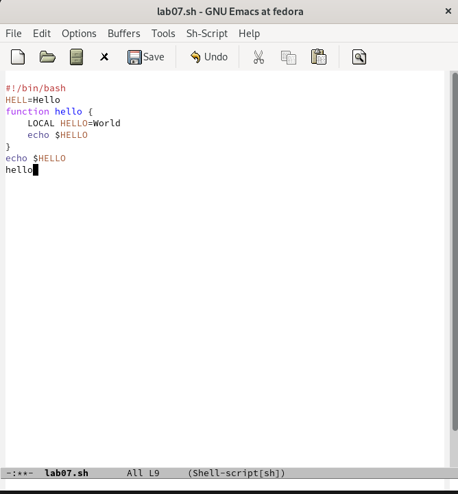{ #fig:003 width=70% }

4. Сохранила файл с помощью комбинации Ctrl-x Ctrl-s (C-x C-s).

5. Проделала с текстом стандартные процедуры редактирования, каждое действие осуществлялось комбинацией клавиш.

5.1. Вырезала одной командой целую строку (С-k).

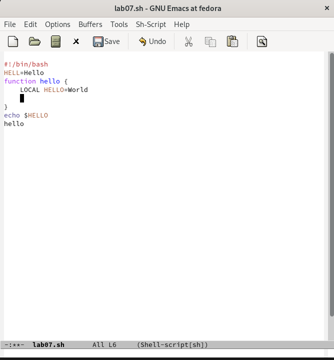{ #fig:004 width=70% }

5.2. Вставила эту строку в конец файла (C-y).(рис. [-@fig:005])

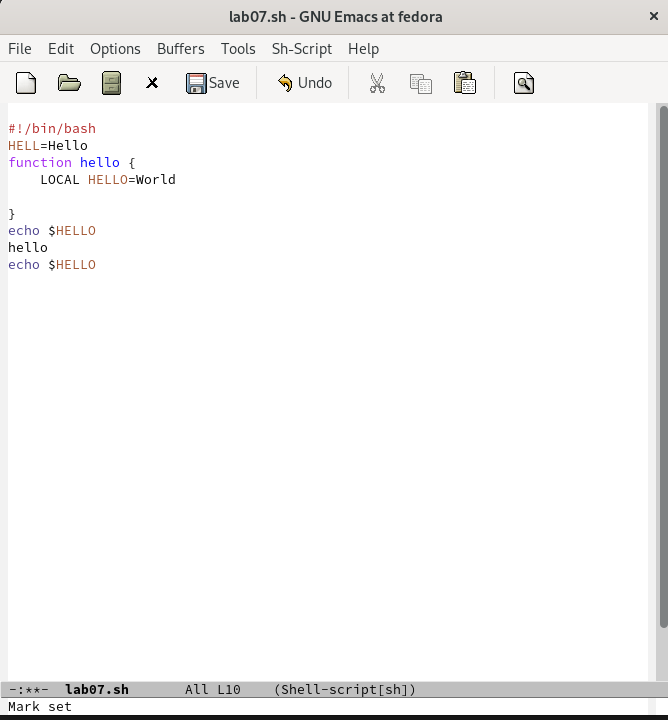{ #fig:005 width=70% }

5.3. Выделила область текста (C-space).(рис. [-@fig:006])

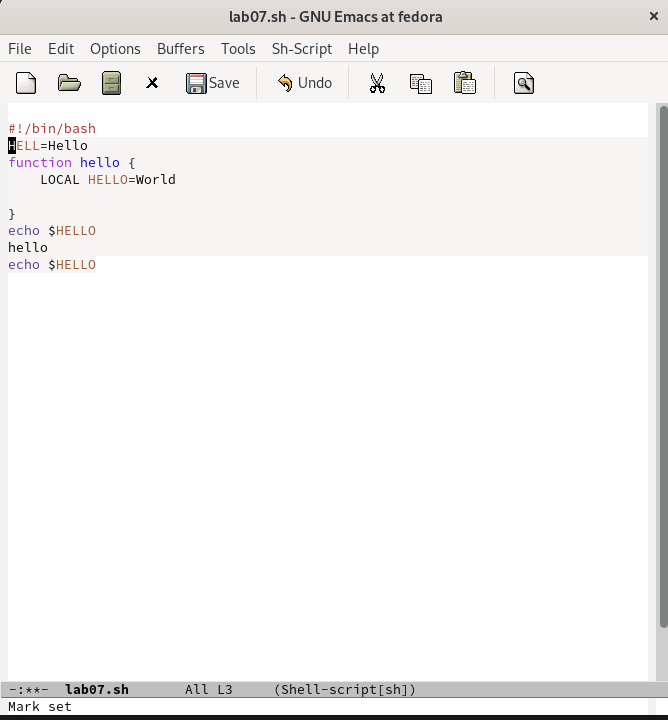{ #fig:006 width=70% }

5.4. Скопировала область в буфер обмена (M-w).(рис. [-@fig:007])

5.5. Вставила область в конец файла.

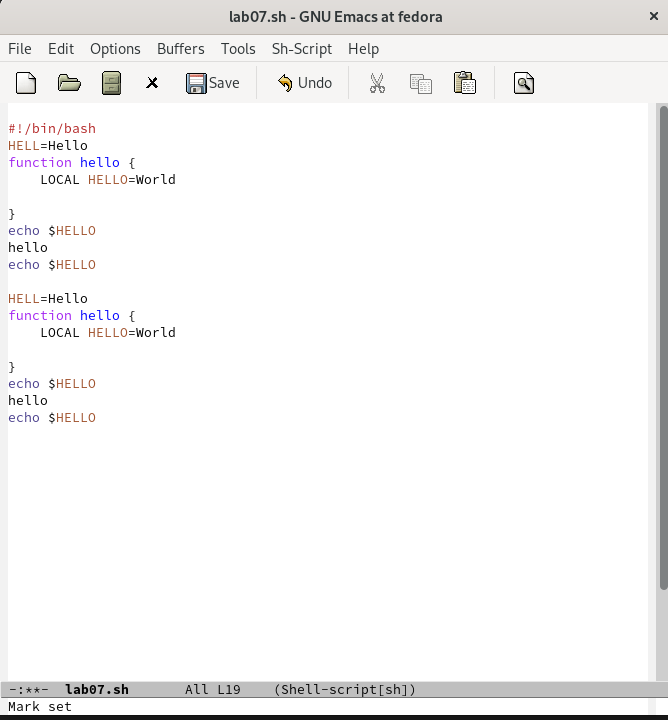{ #fig:007 width=70% }

5.6. Вновь выделила эту область и на этот раз вырезала её (C-w).(рис. [-@fig:008])

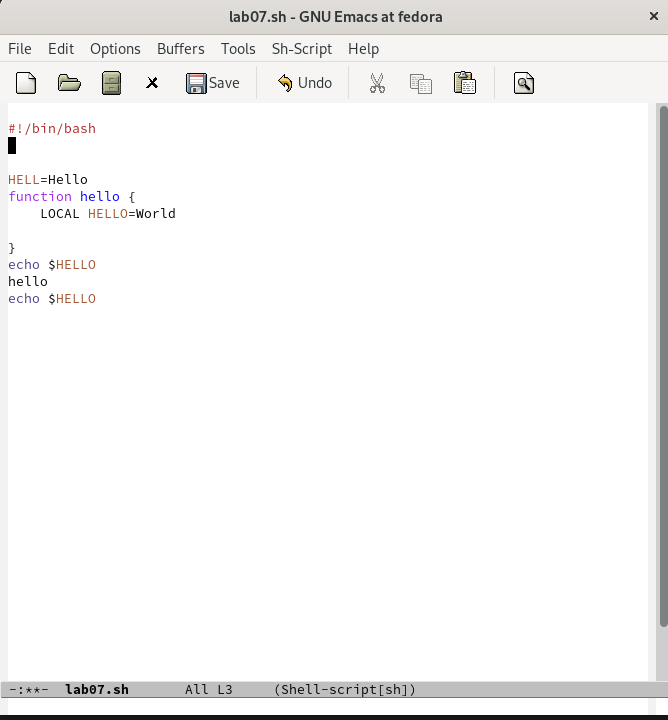{ #fig:008 width=70% }

5.7. Отменила последнее действие (C-/).(рис. [-@fig:009])

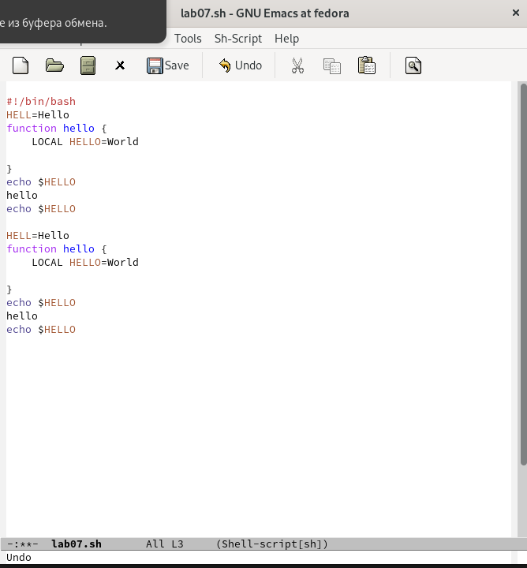{ #fig:009 width=70% }

6. Научилась использовать команды по перемещению курсора.

6.1. Переместила курсор в начало строки (C-a).(рис. [-@fig:010])

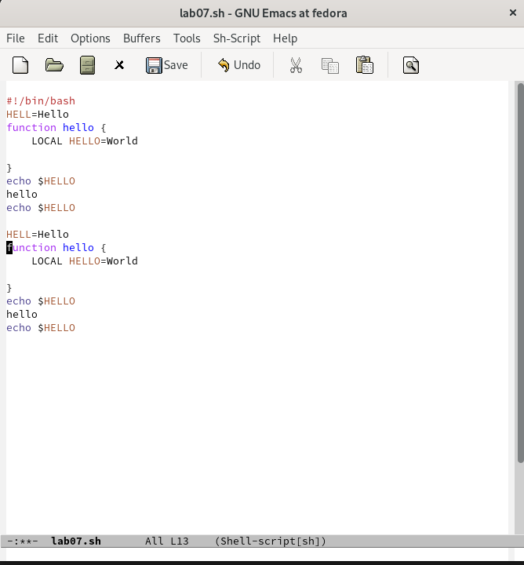{ #fig:010 width=70% }

6.2. Переместила курсор в конец строки (C-e).(рис. [-@fig:011])

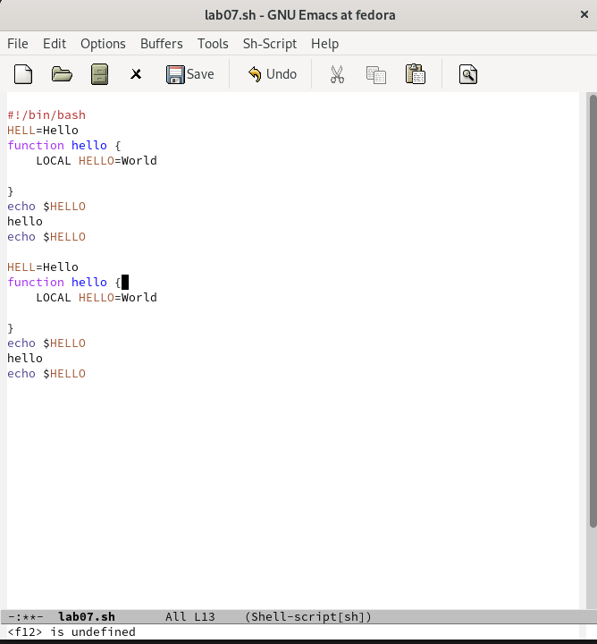{ #fig:011 width=70% }

Переместила курсор в начало буфера (M-<), а также переместила курсор в конец буфера (M->).

7. Управление буферами.

7.1. Вывела список активных буферов на экран (C-x C-b).(рис. [-@fig:012])

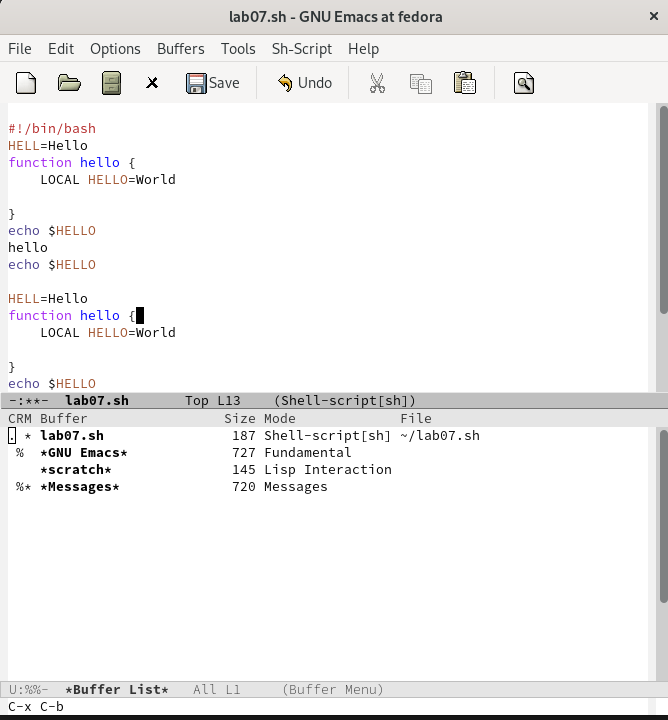{ #fig:012 width=70% }

7.2. Переместилась во вновь открытое окно (C-x) o со списком открытых буферов и переключилась на другой буфер.(рис. [-@fig:013])

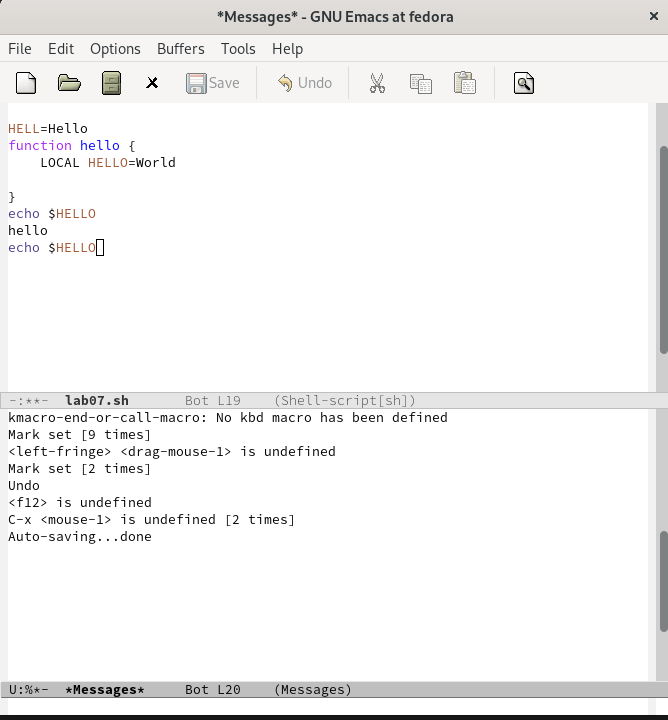{ #fig:013 width=70% }

7.3. Закрыла это окно (C-x 0).(рис. [-@fig:014])

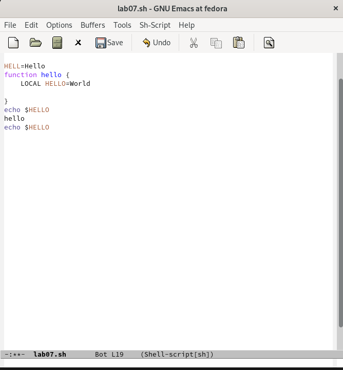{ #fig:014 width=70% }

 Вновь переключилась между буферами, но без вывода их списка на экран (C-x b).

8. Управление окнами.

8.1. Поделила фрейм на 4 части: разделила фрейм на два окна по вертикали

(C-x 3), а затем каждое из этих окон на две части по горизонтали (C-x 2).(рис. [-@fig:015])

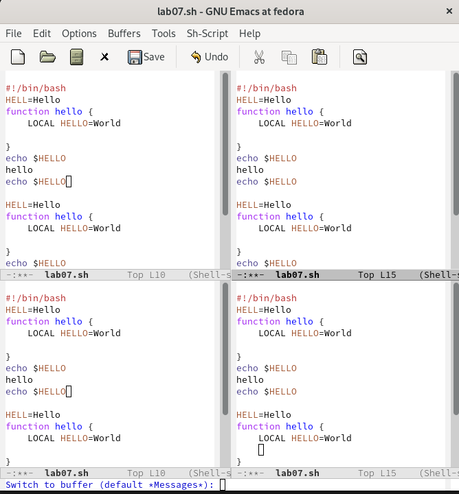{ #fig:015 width=70% }

8.2. В каждом из четырёх созданных окон открыла новый буфер (файл) и ввел несколько строк текста.(рис. [-@fig:016])

{ #fig:016 width=70% }

9. Режим поиска

9.1. Переключилась режим поиска (C-s) и нашел несколько слов, присутствующих в тексте.(рис. [-@fig:017])

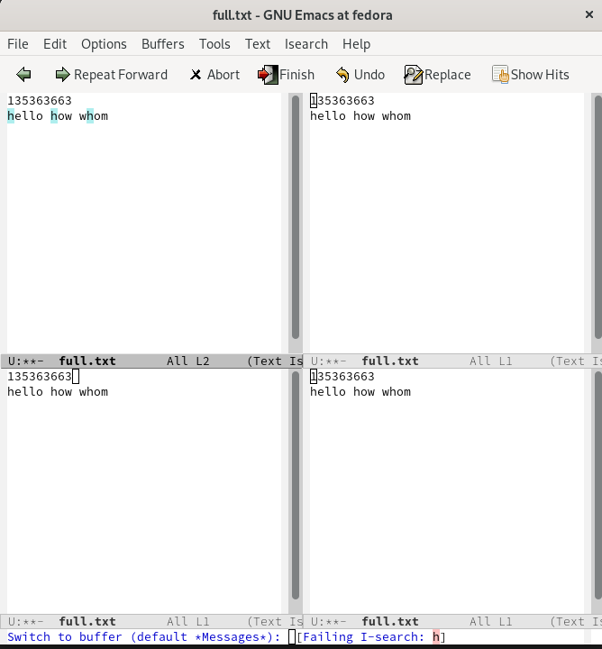{ #fig:017 width=70% }

9.2. Переключалась между результатами поиска, нажимая C-s.(рис. [-@fig:018])

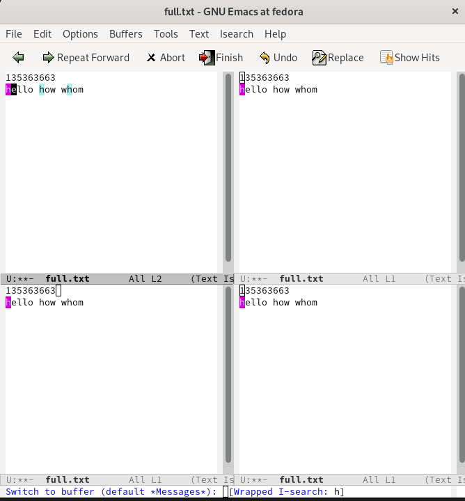{ #fig:018 width=70% }

9.3. Вышла из режима поиска, нажав C-g.(рис. [-@fig:019])

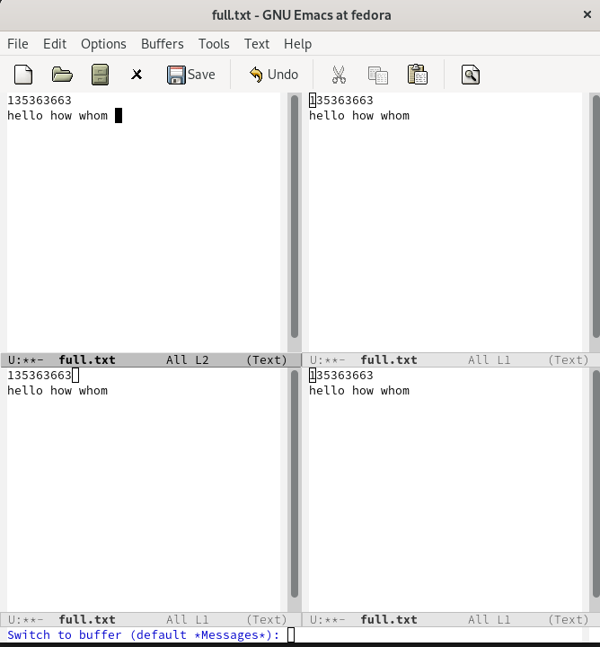{ #fig:019 width=70% }

# Вывод

Познакомилась с операционной системой Linux, получила практические навыки работы с редактором Emacs.

# Контрольные вопросы
1. Кратко охарактеризуйте редактор emacs.

2. Какие особенности данного редактора могутсделать его сложным для освоения но-
вичком?

3. Своими словами опишите,чтотакое буфер и окно втерминологии emacs’а.

4. Можно ли открыть больше 10 буферов в одном окне?

5. Какие буферы создаются по умолчанию при запуске emacs?

6. Какие клавиши вы нажмёте,чтобы ввести следующую комбинацию C-c | и C-c C-|?

7. Как поделитьтекущее окно на две части?

8. В каком файле хранятся настройки редактора emacs?

9. Какую функцию выполняет клавиша и можно ли её переназначить?

10. Какой редактор вам показался удобнее в работе vi или emacs? Поясните почему.

# Ответы на контрольные вопросы:

1. Emacs представляет собой мощный экранный редактор текста, написанный на
языке высокого уровня Elisp.

2. Развитие Emacs в сторону его многогранности послужило причиной того, что и без того интуитивно непонятная программа стала чрезвычайно сложной в применении. В частности, управление осуществляется при помощи различных клавиатурных комбинаций, запомнить которые будет непросто.

3. Буфер – что-то, состоящее из текста. 
Окно – область с одним из буферов.

4. В одном окне можно открыть больше 10 буферов.

5. После запуска emacs без каких-либо параметров в основном окне отображается буфер *scratch*, который используется для оценки выражений Emacs Lisp, а также для заметок, которые вы не хотите сохранять. Этот буфер не сохраняется автоматически.

6. Чтобы ввести следующую комбинацию C-c | я нажму клавиши: Control+c и Shift+\, и для C-c C-|: Control+c и Control+Shift+\.

7. Поделить текущее окно на две части можно двумя комбинациями клавиш: 
C-x 3 или C-x 2.

8. Настроить или расширить Emacs можно написав или изменив файл ~/.emacs.

9. Клавиша  выполняет функцию перемещения курсора в открытом окне также, как и многие другие клавиши её можно переназначить.

10. Редактор emacs показался мне удобнее из-за возможности открытия нескольких окон с буферами и работать комбинациями клавиш в этот редакторе мне было проще.