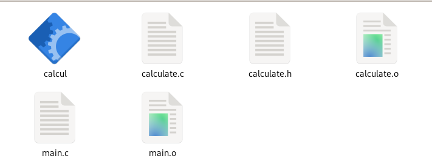
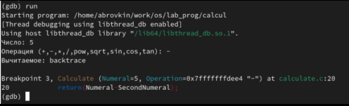

---
## Front matter
lang: ru-RU
title: Средства, применяемые при разработке программного обеспечения в ОС типа UNIX/Linux
author: |
	  Арсоева Залина НБИбд-01-21\inst{1}

institute: |
	\inst{1}Российский Университет Дружбы Народов

date: 11 декабря, 2022, Москва, Россия

## Formatting
mainfont: PT Serif
romanfont: PT Serif
sansfont: PT Sans
monofont: PT Mono
toc: false
slide_level: 2
theme: metropolis
header-includes: 
 - \metroset{progressbar=frametitle,sectionpage=progressbar,numbering=fraction}
 - '\makeatletter'
 - '\beamer@ignorenonframefalse'
 - '\makeatother'
aspectratio: 43
section-titles: true

---

## Цель работы

Приобрести простейшие навыки разработки,анализа,тестирования и отладки приложений в ОС типа UNIX/Linux на примере создания на языке программирования
С калькулятора с простейшими функциями.

## Выполнение лабораторной работы

1. В домашнем каталоге создала подкаталог ~/work/os/lab_prog.

##

2. Создала в нём файлы: calculate.h, calculate.c, main.c. Это примитивнейший калькулятор, способный складывать, вычитать, умножать, делить, возводить число в степень, вычислять квадратный корень, вычислять sin, cos, tan. При запуске он запрашивает первое число, операцию, второе число. После этого программа выводит результат и останавливается.

##

##

Реализация функций калькулятора в файле calculate.c:

##

##

Интерфейсный файл calculate.h, описывающий формат вызова функции калькулятора:

##

Основной файл main.c, реализующий интерфейс пользователя к калькулятору:

##

3. Выполнила компиляцию программы посредством gcc:

##

##

4. Исправила синтаксические ошибки.
5. Создала Makefile

##

В содержании файла указаны флаги компиляции, тип компилятора и файлы, которые должен собрать сборщик.

##

6. С помощью gdb выполнила отладку программы calcul (перед использованием gdb исправил Makefile):
– запустила отладчик GDB, загрузив в него программу для отладки: gdb ./calcul
– для запуска программы внутри отладчика ввела команду run

##

##

##

– для постраничного (по 9 строк) просмотра исходного код использовала команду list
– для просмотра строк с 12 по 15 основного файла использовала list с параметрами:
list 12,15

##

##

##

– для просмотра определённых строк не основного файла использовала list с параметрами: list calculate.c:20,29
– установила точку останова в файле calculate.c на строке номер 21: 
list calculate.c:20,27
break 20
– вывела информацию об имеющихся в проекте точка останова: info breakpoints

##

##

##

– запустила программу внутри отладчика и убедилась, что программа остановится в момент прохождения точки останова
– отладчик выдал следующую информацию, а команда backtrace показала весь стек вызываемых функций от начала программы до текущего места:
– посмотрела, чему равно на этом этапе значение переменной Numeral, введя:
print Numeral
– сравнила с результатом вывода на экран после использования команды:
display Numeral
– убрала точки останова:
info breakpoints
delete 1

##

##

##

##

7. С помощью утилиты splint попробуйте проанализировать коды файлов
calculate.c и main.c.

##

## Вывод:

Приобрела простейшие навыки разработки, анализа, тестирования и отладки приложений в ОС типа UNIX/Linux на примере создания на языке программирования C калькулятора с простейшими функциями.
